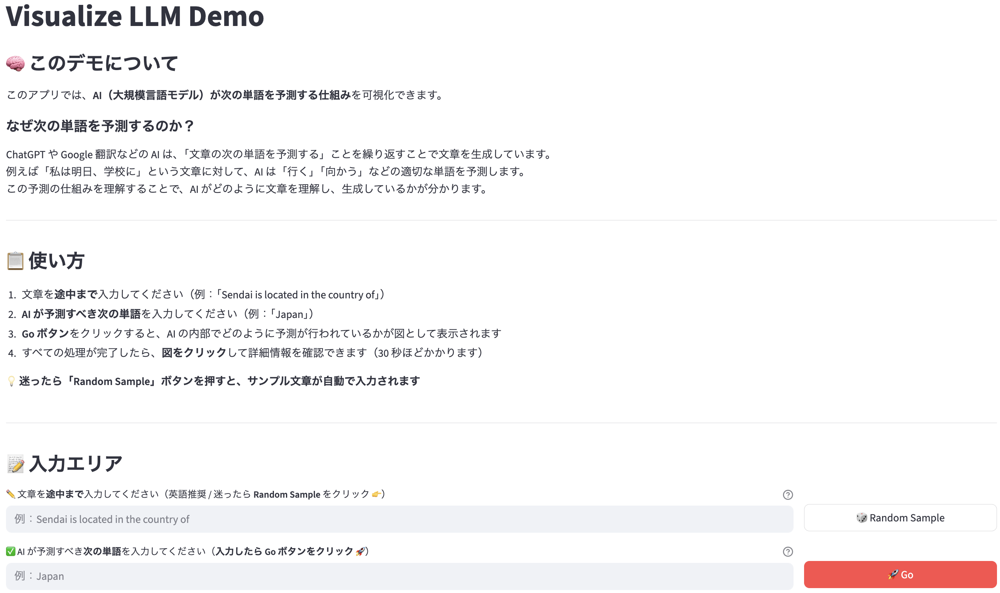

# Visualize LLM App

このアプリケーションは，大規模言語モデル (LLM) の内部動作を可視化する Streamlit 製の Web アプリです．<br>
特定の入力に対して，モデルがどのように予測を行っているかを，**Attention Pattern** や **中間層の出力** といった観点から視覚的に理解できます．

本アプリは，東北大学オープンキャンパスにおける研究室展示の一部として開発されたデモ用アプリケーションです．

<p align="center">
  
</p>

<p align="center">
  
  
</p>

## 🔍 主な機能

- 任意のプロンプト入力に対する LLM の出力可視化
- Attention Pattern の可視化（各層・各ヘッド）
- MLP および Attention 出力の表示

## 🛠️ セットアップ方法（Conda 推奨）

### 1. リポジトリのクローン

```bash
git clone https://github.com/Fukata-K/visualize_llm_app.git
cd visualize_llm_app
```

### 2. Conda 環境の作成

```bash
conda env create -f environment_local.yml
conda activate visualize_llm
```

### 3. アプリの起動

```bash
streamlit run app.py
```

ブラウザが自動で開きます．<br>
開かない場合は `Local URL:` に表示される URL を使用してください．

### 4. アプリの終了

`Ctrl + C` で終了してください（ブラウザを閉じるだけでは終了されません）．


## ⚠️ インストール時の注意点

本アプリでは `pygraphviz` を使用してグラフ構造を描画していますが，このライブラリは環境によってインストール時にエラーが発生することがあります．<br>
以下のような対処を試みてください：

- Graphviz の本体を事前にインストールしておく（OS に応じて `brew install graphviz` や `apt install graphviz` など）
- `pygraphviz` のビルドに失敗する場合は，以下のように明示的に include ディレクトリを指定してインストールを試みる

```bash
brew install graphviz
export CFLAGS="-I$(brew --prefix graphviz)/include"
export LDFLAGS="-L$(brew --prefix graphviz)/lib"
```

## ▶️ アプリの使い方

### 1. プロンプト入力

任意のプロンプトを入力します．<br>
予測させたい部分が次の単語になるような文にしてください．推奨言語は英語です．<br>
`Ex. Sendai is located in the country of`

💡 **迷ったら `Random Sample` を押してください．**<br>
このボタンをクリックすると，事前に用意されたサンプルの中からプロンプトと答えが自動で入力されます．

### 2. 答え入力

入力したプロンプトに対応する正しい答えを入力します．<br>
`Ex. Japan`

### 3. 実行
`Go` を押すと言語モデルの内部動作を表すグラフが表示されます．<br>
約30秒ほど経つとノードをクリックして各種情報を閲覧できるようになります．

<p align="center">
  
</p>

## 📁 ファイル構成（抜粋）

```
.
├── app.py                   # Streamlit アプリのエントリーポイント
├── attention_pattern.py     # Attention Pattern の抽出と可視化
├── display_utils.py         # 描画用ユーティリティ関数
├── logits.py                # logit 関連の処理
├── model.py                 # モデルのロードとキャッシュ
├── prompt.py                # プロンプト処理とランダム選択
├── data/
│ ├── prompt_sample.csv      # ランダム選択用のプロンプトと回答
│ └── README.md              # データセットの説明
├── docs/
│ ├── staff_demo_guide.pdf   # 運営用ガイド
│ └── visitor_demo_guide.pdf # 来場者向けガイド
├── figures/                 # 各種可視化画像を出力（自動生成）
│ ├── attention_patterns/
│ ├── graphs/
│ ├── logits/
│ └── samples/
├── environment_local.yml    # Conda 用のローカル環境定義
├── packages.txt             # system dependencies（pygraphviz 用）
├── requirements.txt         # Streamlit Cloud 用パッケージ定義
└── README.md                # 本ファイル
```

※ `figures/` ディレクトリ内の各種可視化画像は GitHub 上には含まれません．コード実行時に自動生成されます．

## ⚙️ 主なライブラリ

- Python 3.10
- Streamlit (v1.46.1)
- TransformerLens (v2.16.1)
- PyTorch (v2.7.1)
- Matplotlib
- PyGraphviz